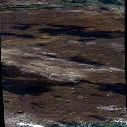
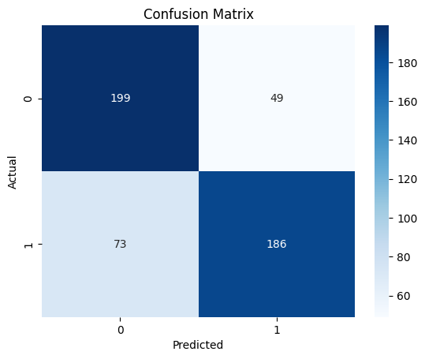

# Categorize the satellite imagery in Accept and Reject buckets

**Author : Deep Joshi**


# Executive summary

The Overhead Imagery team handles the processing and publication of satellite data. We receive vast amounts of imagery from providers, which is stored in various Google Cloud storage before QA and publication. Occasionally, flawed data bypasses QA and ends up in the production, resulting in issues like clouds, snow, color inaccuracies, broken scenes, black patches, and telemetry loss. To prevent this, I propose developing a generalized model to automatically detect these issues before publication, ensuring data quality and minimizing escalations.


# Rationale 

Automating the QA process of satellite imagery not only improves efficiency but also reduces operational costs and latency. This also helps to scale the process without relying on humans in the loop. 


# Research Question 


## Research Question-1

What are the most effective feature extraction methods for accurately identifying cloud cover, color inaccuracies, and other defects in satellite RGB imagery using scikit-learn?


* **Answer:**
    * Directly using raw pixel values can be computationally expensive. This needs to be determined through experimentation.
    * **Recommended Approach:**
        * **Color Histograms:** Extract color distribution features.
        * **Texture Analysis (GLCM):** Use Gray-Level Co-occurrence Matrices to capture texture patterns related to cloud cover and other defects.
        * **PCA:** Use PCA to reduce dimension of RGB images.
    * The optimal combination of these techniques should be determined through experimentation also.


## Research Question-2

How can we optimize the scikit-learn classification model to minimize false positives while maintaining high recall for defect detection?


* **Answer:**
    * **Model Selection:** Experiment with various scikit-learn classifiers, including RandomForestClassifier, Support Vector Machines (SVM), and Logistic Regression.
    * **Hyperparameter Tuning:** Use techniques like GridSearchCV or RandomizedSearchCV to optimize model hyperparameters.
    * **Threshold Adjustment:** If the model outputs probabilities, adjust the classification threshold to balance precision and recall.
    * **Feature Selection:** Use techniques like feature importance or recursive feature elimination to identify and remove irrelevant or redundant features.
    * **Data Augmentation:** augment the training data, to provide more training data for the model.


## Research Question-3

How does the resolution of the input satellite imagery affect the accuracy of the defect detection model?


* **Answer:**
    * Low-resolution images can lead to increased false positives, as subtle defects may be difficult to discern.
    * **Hypothesis:** Increasing the resolution of the input images will improve the model's accuracy, particularly in reducing false positives.
    * **Testing:** Conduct experiments with images of varying resolutions to evaluate the impact on model performance.


## Research Question

What metrics will be used to measure the success of the model?


* **Answer:**
    * **Accuracy:** Overall correctness of the model.
    * **Precision:** The proportion of correctly identified defects among all predicted defects.
    * **Recall:** The proportion of correctly identified defects among all actual defects.
    * **F1-score:** The harmonic mean of precision and recall.
    * **False positive rate:** the amount of good images that are incorrectly marked as bad.


# Data Sources:


* A dataset of proview images at 1024x1024 pixel images downloaded from the satellite imagery collection.
* The dataset is categorized into two classes:
    * **Accept:** Images deemed acceptable for publication after QA.
    * **Reject:** Images identified as having defects (clouds, color issues, etc.) and rejected during QA.
* The dataset consists of 1266 images per category, totaling 2532 images.
* Images are in JPEG format.
* Images are also converted to 512x512 and 256x256 using below command in the ubuntu
    * Example: Convert accept images to 256 x 256  

```convert "accept/*.jpeg[256x]" -set filename:base "%[basename]" "accept_256/%[filename:base].jpeg" ```

## Example Accepted Images


<table>
  <tr>
   <td>


   </td>
   <td>


   </td>
   <td>


   </td>
  </tr>
</table>


## Example Rejected Images


<table>
  <tr>
   <td>



   </td>
   <td>


   </td>
   <td>


   </td>
  </tr>
</table>


# Methodology

Images from each category were resized to 256x256 pixels using the CV2 module. These images were then converted into one-dimensional arrays using the flatten method.
The dataset was split using Scikit-learn’s `train_test_split` method, with 20% allocated for testing. For baseline classification, Scikit-learn’s RandomForestClassifier was utilized with `n_estimators=256`.
Finally, the model was trained on the test data to evaluate its accuracy.


# Results 
The accuracy of the baseline model is 75%. The confusion matrix shows that the model is able to correctly classify most of the images, but there are some misclassifications.
The ROC curve shows that the model is able to distinguish between the two classes of images fairly well.


## Confusion Matrix




## ROC Curve

**In the given ROC curve,** it appears that a threshold around **0.2-0.3** might offer a good balance between TPR and FPR, as it's relatively close to the top-left corner.


# Next Steps:
- **Experiment with alternative feature extraction techniques** to enhance model performance.
- **Optimize model parameters** using GridSearchCV or RandomizedSearchCV.
- **Evaluate additional metrics**, such as precision, recall, and F1-score, to ensure a balanced classification.

# Outline of project
- [Link to notebook](https://github.com/deepjoshi1/capstone_project/blob/52154fdbd2244b0eff6fc8111d898049c3a02cda/Capstone_Assignment_Initial_Report_and_Exploratory_Data_Analysis.ipynb)

